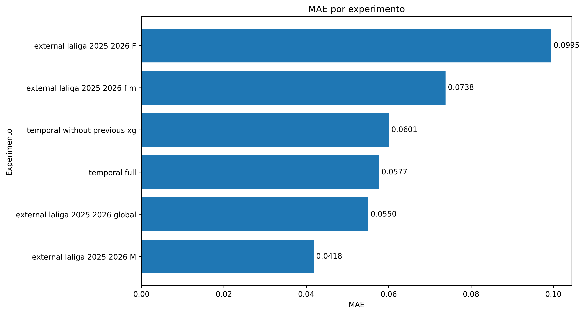
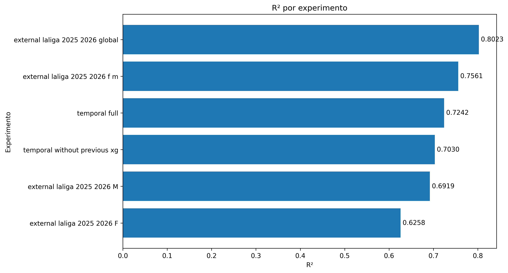
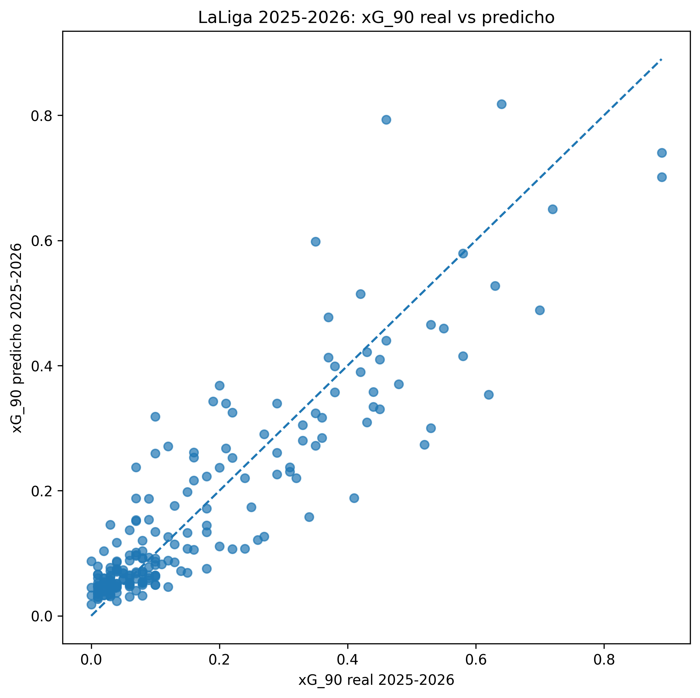
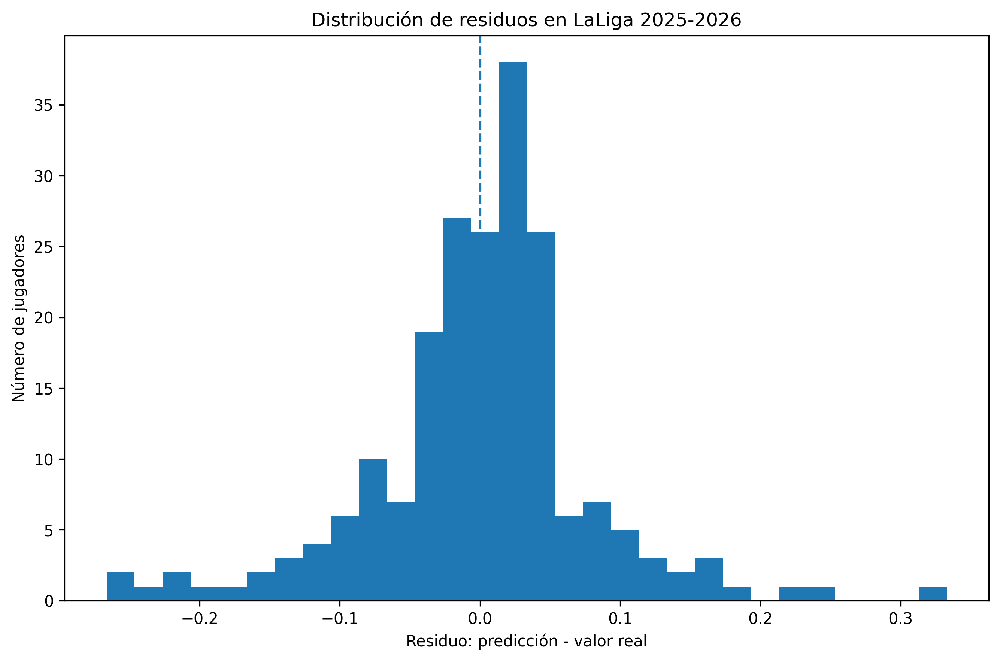
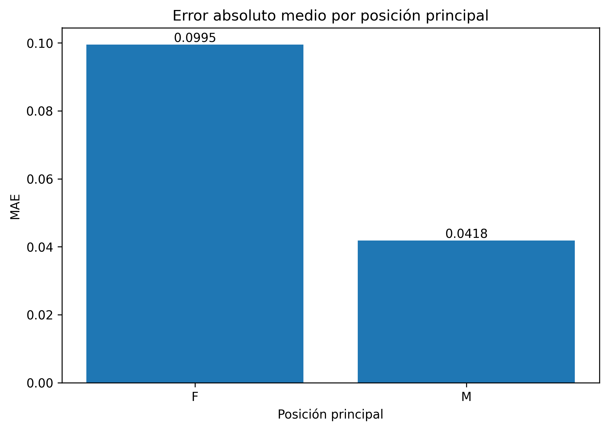
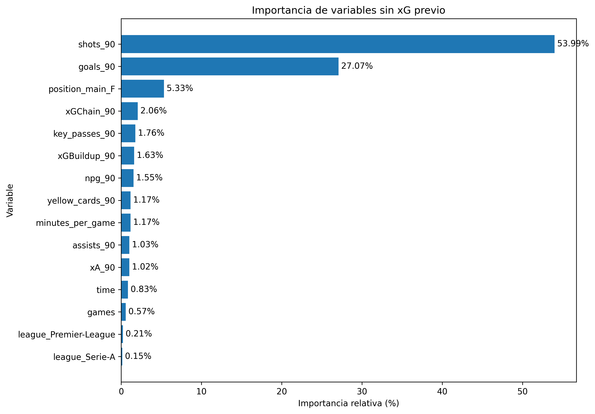

# Figuras de resultados

Este archivo resume las figuras generadas automáticamente.

## Comparación de MAE por experimento

## Comparación de R² por experimento

## xG_90 real vs predicho en LaLiga 2025-2026

## Distribución de residuos en LaLiga 2025-2026

## Error absoluto medio por posición F/M

## Importancia de variables sin xG previo

