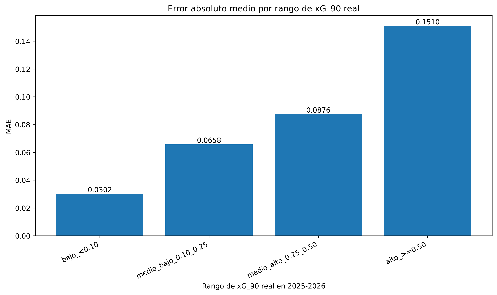

# Análisis del error por rangos de xG_90

## Objetivo

Este análisis evalúa si el error del modelo cambia según el nivel real de `xG_90` del jugador en la temporada 2025-2026.

La hipótesis de partida es que el modelo debería cometer errores menores en jugadores con baja producción ofensiva y errores mayores en jugadores de alto `xG_90`, ya que estos perfiles suelen presentar mayor variabilidad contextual y deportiva.

## Rangos utilizados

- `bajo_<0.10`: jugadores con xG_90 real inferior a 0.10
- `medio_bajo_0.10_0.25`: jugadores entre 0.10 y 0.25
- `medio_alto_0.25_0.50`: jugadores entre 0.25 y 0.50
- `alto_>=0.50`: jugadores con xG_90 real igual o superior a 0.50

## Tabla resumen

| xg_range             |   n_players |   actual_xg_90_mean |   predicted_xg_90_mean |    mae |   mean_signed_error |      r2 |   overestimations |   underestimations |
|:---------------------|------------:|--------------------:|-----------------------:|-------:|--------------------:|--------:|------------------:|-------------------:|
| bajo_<0.10           |         114 |              0.0439 |                 0.0661 | 0.0302 |              0.0223 | -1.3627 |                89 |                 25 |
| medio_bajo_0.10_0.25 |          44 |              0.1525 |                 0.1613 | 0.0658 |              0.0088 | -2.4854 |                18 |                 26 |
| medio_alto_0.25_0.50 |          34 |              0.3653 |                 0.3316 | 0.0876 |             -0.0337 | -1.9787 |                 8 |                 26 |
| alto_>=0.50          |          13 |              0.6446 |                 0.521  | 0.151  |             -0.1236 | -0.9749 |                 1 |                 12 |

## Figura generada

## Interpretación

El rango con mayor MAE es `alto_>=0.50`, con un error absoluto medio de 0.1510.

El rango con menor MAE es `bajo_<0.10`, con un error absoluto medio de 0.0302.

Si el error aumenta en los rangos de mayor `xG_90`, esto refuerza la interpretación de que el modelo presenta un comportamiento conservador: predice con mayor estabilidad perfiles de bajo o medio rendimiento ofensivo, pero tiene más dificultad para anticipar jugadores que alcanzan valores ofensivos altos en la temporada objetivo.