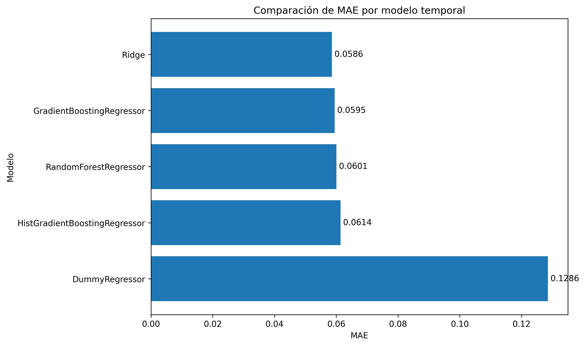
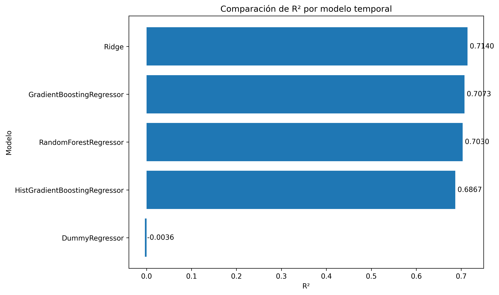

# Comparación de modelos temporales

## Objetivo

Este experimento compara distintos algoritmos de regresión para predecir el `xG_90` de la temporada siguiente a partir de métricas de la temporada actual.

La comparación utiliza el conjunto de variables `without_previous_xg`, por lo que no se emplean `xG_90` ni `npxG_90` de la temporada anterior como predictores directos.

## Configuración experimental

- Periodo de test: 2023-2024 → 2024-2025
- Conjunto de variables: `without_previous_xg`
- Variable objetivo: `target_next_xG_90`

## Resultados globales

| model                         |   train_rows |   test_rows |    mae |      r2 | test_season   | test_next_season   |
|:------------------------------|-------------:|------------:|-------:|--------:|:--------------|:-------------------|
| Ridge                         |         3003 |         954 | 0.0586 |  0.714  | 2023-2024     | 2024-2025          |
| GradientBoostingRegressor     |         3003 |         954 | 0.0595 |  0.7073 | 2023-2024     | 2024-2025          |
| RandomForestRegressor         |         3003 |         954 | 0.0601 |  0.703  | 2023-2024     | 2024-2025          |
| HistGradientBoostingRegressor |         3003 |         954 | 0.0614 |  0.6867 | 2023-2024     | 2024-2025          |
| DummyRegressor                |         3003 |         954 | 0.1286 | -0.0036 | 2023-2024     | 2024-2025          |

## Resultados por rango de xG_90

| model                         | xg_range             |   n_players |   actual_xg_90_mean |   predicted_xg_90_mean |    mae |       r2 |   mean_signed_error |   overestimations |   underestimations |
|:------------------------------|:---------------------|------------:|--------------------:|-----------------------:|-------:|---------:|--------------------:|------------------:|-------------------:|
| Ridge                         | alto_>=0.50          |          58 |              0.6791 |                 0.4748 | 0.2237 |  -1.6811 |             -0.2044 |                 7 |                 51 |
| GradientBoostingRegressor     | alto_>=0.50          |          58 |              0.6791 |                 0.4764 | 0.2317 |  -1.7968 |             -0.2027 |                 8 |                 50 |
| HistGradientBoostingRegressor | alto_>=0.50          |          58 |              0.6791 |                 0.4762 | 0.237  |  -1.8772 |             -0.203  |                 8 |                 50 |
| RandomForestRegressor         | alto_>=0.50          |          58 |              0.6791 |                 0.4603 | 0.2387 |  -1.8192 |             -0.2188 |                 5 |                 53 |
| DummyRegressor                | alto_>=0.50          |          58 |              0.6791 |                 0.1523 | 0.5268 |  -9.3018 |             -0.5268 |                 0 |                 58 |
| GradientBoostingRegressor     | bajo_<0.10           |         506 |              0.0481 |                 0.0693 | 0.0311 |  -1.3309 |              0.0213 |               380 |                126 |
| HistGradientBoostingRegressor | bajo_<0.10           |         506 |              0.0481 |                 0.0687 | 0.0315 |  -1.5022 |              0.0207 |               366 |                140 |
| Ridge                         | bajo_<0.10           |         506 |              0.0481 |                 0.0649 | 0.0317 |  -1.6138 |              0.0169 |               345 |                161 |
| RandomForestRegressor         | bajo_<0.10           |         506 |              0.0481 |                 0.0702 | 0.0317 |  -1.4901 |              0.0222 |               379 |                127 |
| DummyRegressor                | bajo_<0.10           |         506 |              0.0481 |                 0.1523 | 0.1042 | -15.4858 |              0.1042 |               506 |                  0 |
| Ridge                         | medio_alto_0.25_0.50 |         153 |              0.3504 |                 0.332  | 0.0824 |  -1.594  |             -0.0185 |                58 |                 95 |
| RandomForestRegressor         | medio_alto_0.25_0.50 |         153 |              0.3504 |                 0.33   | 0.0851 |  -1.8005 |             -0.0204 |                63 |                 90 |
| GradientBoostingRegressor     | medio_alto_0.25_0.50 |         153 |              0.3504 |                 0.3346 | 0.0859 |  -1.8372 |             -0.0159 |                67 |                 86 |
| HistGradientBoostingRegressor | medio_alto_0.25_0.50 |         153 |              0.3504 |                 0.3313 | 0.0929 |  -2.2561 |             -0.0191 |                68 |                 85 |
| DummyRegressor                | medio_alto_0.25_0.50 |         153 |              0.3504 |                 0.1523 | 0.1981 |  -8.8969 |             -0.1981 |                 0 |                153 |
| DummyRegressor                | medio_bajo_0.10_0.25 |         237 |              0.1611 |                 0.1523 | 0.0381 |  -0.0396 |             -0.0088 |               116 |                121 |
| Ridge                         | medio_bajo_0.10_0.25 |         237 |              0.1611 |                 0.1583 | 0.0603 |  -2.1732 |             -0.0028 |               101 |                136 |
| RandomForestRegressor         | medio_bajo_0.10_0.25 |         237 |              0.1611 |                 0.1593 | 0.0608 |  -2.1772 |             -0.0018 |                95 |                142 |
| GradientBoostingRegressor     | medio_bajo_0.10_0.25 |         237 |              0.1611 |                 0.157  | 0.0609 |  -2.047  |             -0.0041 |                92 |                145 |
| HistGradientBoostingRegressor | medio_bajo_0.10_0.25 |         237 |              0.1611 |                 0.1552 | 0.0618 |  -2.3729 |             -0.0059 |                90 |                147 |

## Figuras generadas

## Interpretación

El modelo con menor MAE global es `Ridge`, con MAE = 0.0586.

El modelo con mayor R² global es `Ridge`, con R² = 0.7140.

En el rango de alto rendimiento ofensivo (`xG_90 >= 0.50`), el menor MAE lo obtiene `Ridge`, con MAE = 0.2237.

Esta comparación permite valorar si el Random Forest utilizado como modelo principal es competitivo frente a modelos lineales y métodos de boosting. Si los modelos de boosting reducen el error en perfiles de alto `xG_90`, podrían considerarse como alternativa o extensión del sistema.