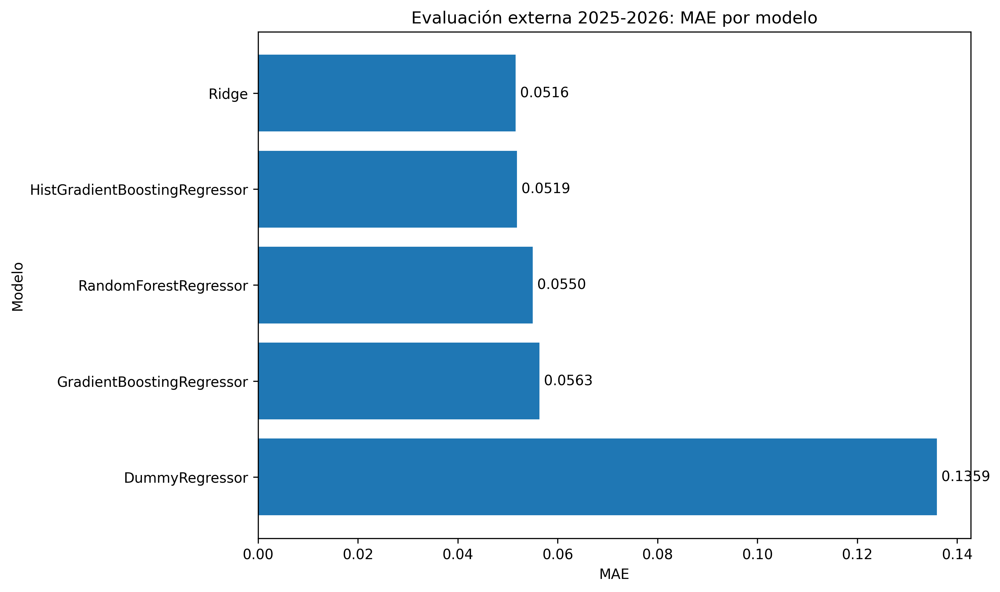
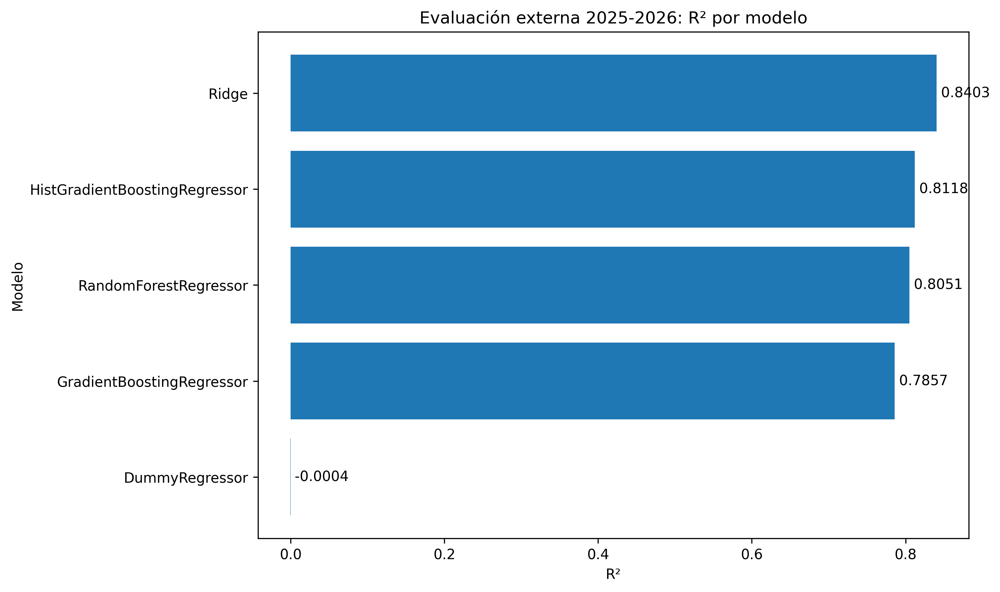
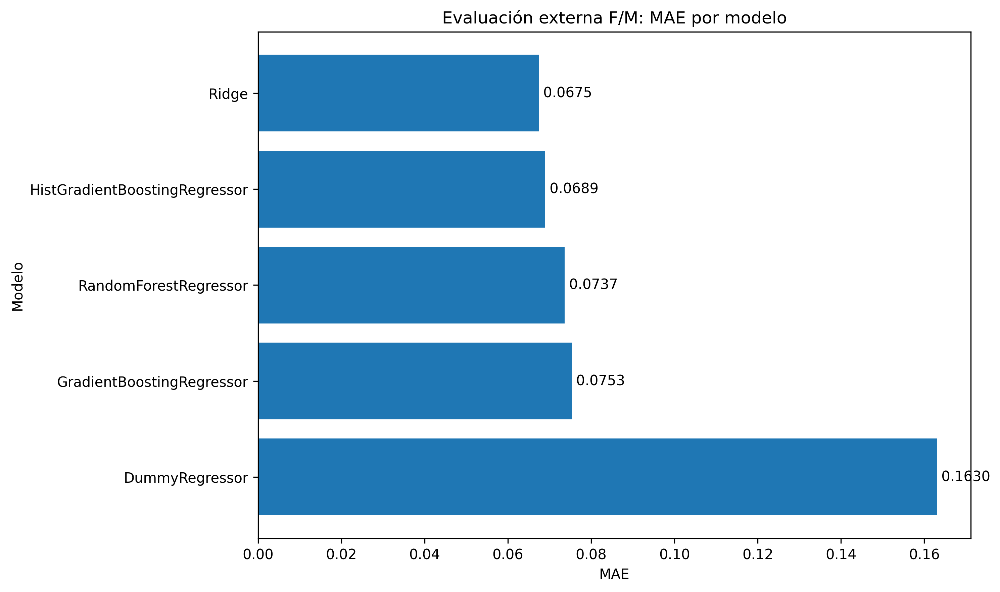
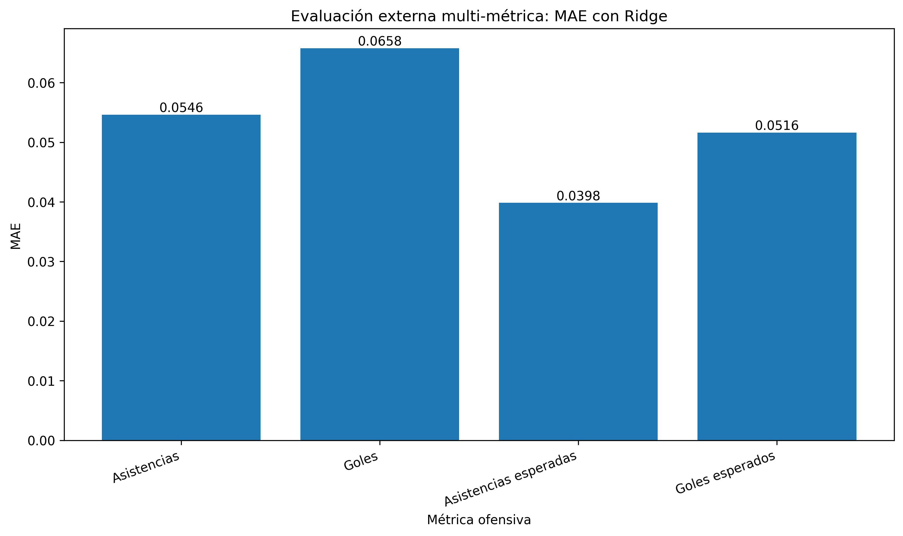
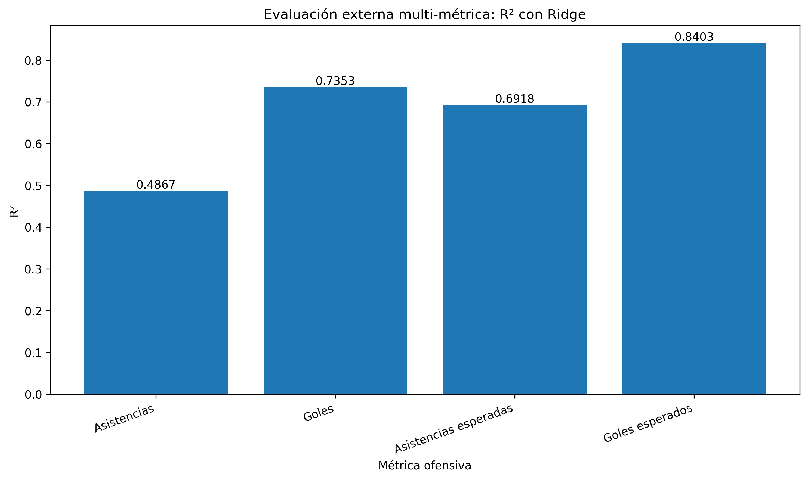

# Comparación externa de modelos y evaluación multi-métrica

## Objetivo

Este experimento evalúa el rendimiento del sistema sobre una prueba externa 2025-2026. En primer lugar se comparan distintos modelos para predecir `xG_90`. En segundo lugar, una vez seleccionado Ridge como modelo final, se amplía la evaluación a varias métricas ofensivas normalizadas por 90 minutos.

## Comparación externa de modelos para xG_90

| model                         | feature_set         |   training_rows |   matched_players |    mae |      r2 | input_season   | target_season   |
|:------------------------------|:--------------------|----------------:|------------------:|-------:|--------:|:---------------|:----------------|
| Ridge                         | without_previous_xg |            3957 |               205 | 0.0516 |  0.8403 | 2024-2025      | 2025-2026       |
| HistGradientBoostingRegressor | without_previous_xg |            3957 |               205 | 0.0519 |  0.8118 | 2024-2025      | 2025-2026       |
| RandomForestRegressor         | without_previous_xg |            3957 |               205 | 0.055  |  0.8051 | 2024-2025      | 2025-2026       |
| GradientBoostingRegressor     | without_previous_xg |            3957 |               205 | 0.0563 |  0.7857 | 2024-2025      | 2025-2026       |
| DummyRegressor                | without_previous_xg |            3957 |               205 | 0.1359 | -0.0004 | 2024-2025      | 2025-2026       |

El menor MAE global para `xG_90` lo obtiene `Ridge`, con MAE = 0.0516 y R² = 0.8403.

## Comparación externa F/M para xG_90

| model                         | feature_set         |   training_rows |   matched_players_f_m |    mae |      r2 | input_season   | target_season   |
|:------------------------------|:--------------------|----------------:|----------------------:|-------:|--------:|:---------------|:----------------|
| Ridge                         | without_previous_xg |            3957 |                   110 | 0.0675 |  0.8103 | 2024-2025      | 2025-2026       |
| HistGradientBoostingRegressor | without_previous_xg |            3957 |                   110 | 0.0689 |  0.7705 | 2024-2025      | 2025-2026       |
| RandomForestRegressor         | without_previous_xg |            3957 |                   110 | 0.0737 |  0.7599 | 2024-2025      | 2025-2026       |
| GradientBoostingRegressor     | without_previous_xg |            3957 |                   110 | 0.0753 |  0.735  | 2024-2025      | 2025-2026       |
| DummyRegressor                | without_previous_xg |            3957 |                   110 | 0.163  | -0.1913 | 2024-2025      | 2025-2026       |

En el subconjunto F/M, el menor MAE para `xG_90` lo obtiene `Ridge`, con MAE = 0.0675 y R² = 0.8103.

## Análisis del rango alto de xG_90

| model                         | xg_range             |   n_players |   actual_xg_90_mean |   predicted_xg_90_mean |    mae |       r2 |   mean_signed_error |   overestimations |   underestimations |
|:------------------------------|:---------------------|------------:|--------------------:|-----------------------:|-------:|---------:|--------------------:|------------------:|-------------------:|
| HistGradientBoostingRegressor | alto_>=0.50          |          13 |              0.6446 |                 0.5429 | 0.1276 |  -0.5895 |             -0.1017 |                 4 |                  9 |
| Ridge                         | alto_>=0.50          |          13 |              0.6446 |                 0.5623 | 0.1339 |  -0.7533 |             -0.0823 |                 2 |                 11 |
| GradientBoostingRegressor     | alto_>=0.50          |          13 |              0.6446 |                 0.5453 | 0.1347 |  -0.7802 |             -0.0993 |                 3 |                 10 |
| RandomForestRegressor         | alto_>=0.50          |          13 |              0.6446 |                 0.5169 | 0.1517 |  -0.9355 |             -0.1277 |                 1 |                 12 |
| DummyRegressor                | alto_>=0.50          |          13 |              0.6446 |                 0.1549 | 0.4897 | -16.4869 |             -0.4897 |                 0 |                 13 |
| HistGradientBoostingRegressor | bajo_<0.10           |         114 |              0.0439 |                 0.0637 | 0.0289 |  -1.2902 |              0.0198 |                88 |                 26 |
| RandomForestRegressor         | bajo_<0.10           |         114 |              0.0439 |                 0.0661 | 0.0302 |  -1.3779 |              0.0223 |                88 |                 26 |
| Ridge                         | bajo_<0.10           |         114 |              0.0439 |                 0.0627 | 0.0302 |  -1.3414 |              0.0188 |                82 |                 32 |
| GradientBoostingRegressor     | bajo_<0.10           |         114 |              0.0439 |                 0.066  | 0.0305 |  -1.4301 |              0.0221 |                89 |                 25 |
| DummyRegressor                | bajo_<0.10           |         114 |              0.0439 |                 0.1549 | 0.111  | -17.9416 |              0.111  |               114 |                  0 |
| Ridge                         | medio_alto_0.25_0.50 |          34 |              0.3653 |                 0.3296 | 0.0744 |  -0.8005 |             -0.0357 |                 8 |                 26 |
| RandomForestRegressor         | medio_alto_0.25_0.50 |          34 |              0.3653 |                 0.3319 | 0.0874 |  -1.8911 |             -0.0334 |                 8 |                 26 |
| HistGradientBoostingRegressor | medio_alto_0.25_0.50 |          34 |              0.3653 |                 0.3399 | 0.0874 |  -2.0519 |             -0.0254 |                11 |                 23 |
| GradientBoostingRegressor     | medio_alto_0.25_0.50 |          34 |              0.3653 |                 0.3321 | 0.0949 |  -2.3914 |             -0.0332 |                10 |                 24 |
| DummyRegressor                | medio_alto_0.25_0.50 |          34 |              0.3653 |                 0.1549 | 0.2104 | -10.3791 |             -0.2104 |                 0 |                 34 |
| DummyRegressor                | medio_bajo_0.10_0.25 |          44 |              0.1525 |                 0.1549 | 0.0384 |  -0.0029 |              0.0024 |                24 |                 20 |
| HistGradientBoostingRegressor | medio_bajo_0.10_0.25 |          44 |              0.1525 |                 0.1569 | 0.0615 |  -2.5581 |              0.0044 |                18 |                 26 |
| Ridge                         | medio_bajo_0.10_0.25 |          44 |              0.1525 |                 0.1591 | 0.065  |  -2.0934 |              0.0066 |                22 |                 22 |
| RandomForestRegressor         | medio_bajo_0.10_0.25 |          44 |              0.1525 |                 0.161  | 0.0657 |  -2.4931 |              0.0085 |                18 |                 26 |
| GradientBoostingRegressor     | medio_bajo_0.10_0.25 |          44 |              0.1525 |                 0.1606 | 0.0704 |  -3.4167 |              0.0081 |                19 |                 25 |

En jugadores con `xG_90 >= 0.50`, el menor MAE corresponde a `HistGradientBoostingRegressor`, con MAE = 0.1276.

## Evaluación multi-métrica con Ridge

Tras seleccionar Ridge como modelo final principal, se entrena un modelo Ridge independiente para cada una de las siguientes métricas: `xG_90`, `goals_90`, `assists_90` y `xA_90`.

| metric_key   | metric_label          | model   |   training_rows |   matched_players |    mae |     r2 | input_season   | target_season   |
|:-------------|:----------------------|:--------|----------------:|------------------:|-------:|-------:|:---------------|:----------------|
| assists_90   | Asistencias           | Ridge   |            3957 |               205 | 0.0546 | 0.4867 | 2024-2025      | 2025-2026       |
| goals_90     | Goles                 | Ridge   |            3957 |               205 | 0.0658 | 0.7353 | 2024-2025      | 2025-2026       |
| xA_90        | Asistencias esperadas | Ridge   |            3957 |               205 | 0.0398 | 0.6918 | 2024-2025      | 2025-2026       |
| xG_90        | Goles esperados       | Ridge   |            3957 |               205 | 0.0516 | 0.8403 | 2024-2025      | 2025-2026       |

## Evaluación multi-métrica F/M con Ridge

| metric_key   | metric_label          | model   |   training_rows |   matched_players_f_m |    mae |     r2 | input_season   | target_season   |
|:-------------|:----------------------|:--------|----------------:|----------------------:|-------:|-------:|:---------------|:----------------|
| assists_90   | Asistencias           | Ridge   |            3957 |                   110 | 0.0657 | 0.3936 | 2024-2025      | 2025-2026       |
| goals_90     | Goles                 | Ridge   |            3957 |                   110 | 0.0883 | 0.687  | 2024-2025      | 2025-2026       |
| xA_90        | Asistencias esperadas | Ridge   |            3957 |                   110 | 0.0449 | 0.6533 | 2024-2025      | 2025-2026       |
| xG_90        | Goles esperados       | Ridge   |            3957 |                   110 | 0.0675 | 0.8103 | 2024-2025      | 2025-2026       |

## Figuras generadas

## Interpretación

La comparación externa mantiene `xG_90` como métrica principal de selección del modelo, ya que fue el objetivo central del sistema. La extensión multi-métrica permite analizar dimensiones adicionales del rendimiento ofensivo, como producción goleadora real, asistencia real y generación esperada de asistencias.

Las métricas esperadas, como `xG_90` y `xA_90`, suelen ser más estables conceptualmente que goles y asistencias reales, que dependen en mayor medida de factores contextuales y de la varianza propia de la finalización.