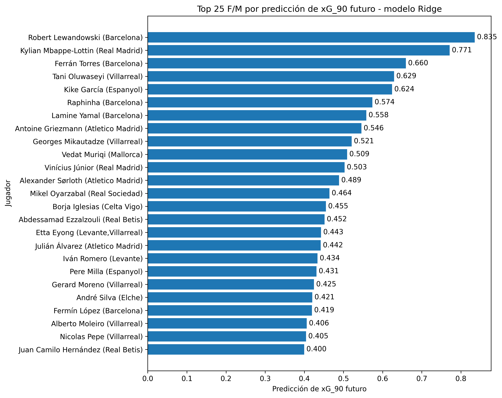

# Predicciones actuales de LaLiga con el modelo final Ridge

## Objetivo

Este informe recoge las predicciones generadas sobre los jugadores actuales de LaLiga utilizando el modelo final seleccionado: Ridge con el conjunto de variables `without_previous_xg`.

La predicción representa una estimación del `xG_90` futuro del jugador a partir de sus métricas actuales de participación y producción ofensiva.

## Configuración

- Modelo: `Ridge`
- Conjunto de variables: `without_previous_xg`
- Variable estimada: `predicted_next_xG_90`
- Jugadores no porteros evaluados: 309
- Jugadores F/M evaluados: 175

## Top 25 F/M

| model   | feature_set         |    id | player_name           | position   | position_main   | team_title         | league   | season    |   games |   time |   minutes_per_game |   goals_90 |   assists_90 |   xA_90 |   shots_90 |   key_passes_90 |   xGChain_90 |   xGBuildup_90 |   predicted_next_xG_90 |
|:--------|:--------------------|------:|:----------------------|:-----------|:----------------|:-------------------|:---------|:----------|--------:|-------:|-------------------:|-----------:|-------------:|--------:|-----------:|----------------:|-------------:|---------------:|-----------------------:|
| Ridge   | without_previous_xg |   227 | Robert Lewandowski    | F S        | F               | Barcelona          | La-Liga  | 2025-2026 |      12 |    634 |            52.8333 |     1.1356 |       0.142  |  0.1983 |     4.4006 |          0.8517 |       1.3035 |         0.3556 |                 0.8354 |
| Ridge   | without_previous_xg |  3423 | Kylian Mbappe-Lottin  | F          | F               | Real Madrid        | La-Liga  | 2025-2026 |      15 |   1321 |            88.0667 |     1.0901 |       0.2725 |  0.3683 |     4.8372 |          2.9296 |       1.1396 |         0.3538 |                 0.7713 |
| Ridge   | without_previous_xg |  6441 | Ferrán Torres         | F M S      | F               | Barcelona          | La-Liga  | 2025-2026 |      14 |    863 |            61.6429 |     0.8343 |       0.1043 |  0.2078 |     3.3372 |          1.5643 |       1.1014 |         0.2239 |                 0.6596 |
| Ridge   | without_previous_xg | 13996 | Tani Oluwaseyi        | F S        | F               | Villarreal         | La-Liga  | 2025-2026 |      11 |    430 |            39.0909 |     0.4186 |       0.2093 |  0.3692 |     2.7209 |          0.8372 |       1.1421 |         0.0483 |                 0.6295 |
| Ridge   | without_previous_xg |  5074 | Kike García           | F S        | F               | Espanyol           | La-Liga  | 2025-2026 |      13 |    531 |            40.8462 |     0.5085 |       0      |  0.1872 |     3.7288 |          1.5254 |       0.9288 |         0.1326 |                 0.6242 |
| Ridge   | without_previous_xg |  8026 | Raphinha              | F M S      | F               | Barcelona          | La-Liga  | 2025-2026 |       9 |    547 |            60.7778 |     0.6581 |       0.4936 |  0.4035 |     3.9488 |          2.9616 |       1.4924 |         0.6559 |                 0.5741 |
| Ridge   | without_previous_xg | 11527 | Lamine Yamal          | F M S      | F               | Barcelona          | La-Liga  | 2025-2026 |      11 |    906 |            82.3636 |     0.4967 |       0.6954 |  0.3813 |     5.0662 |          1.9868 |       1.1273 |         0.5309 |                 0.5583 |
| Ridge   | without_previous_xg |  2270 | Antoine Griezmann     | F S        | F               | Atletico Madrid    | La-Liga  | 2025-2026 |      15 |    570 |            38      |     0.6316 |       0      |  0.2174 |     3.6316 |          2.0526 |       1.212  |         0.4696 |                 0.5458 |
| Ridge   | without_previous_xg |  8187 | Georges Mikautadze    | F S        | F               | Villarreal         | La-Liga  | 2025-2026 |       9 |    473 |            52.5556 |     0.3805 |       0.3805 |  0.2366 |     2.8541 |          0.9514 |       0.8175 |         0.0423 |                 0.5209 |
| Ridge   | without_previous_xg |  9002 | Vedat Muriqi          | F S        | F               | Mallorca           | La-Liga  | 2025-2026 |      13 |   1011 |            77.7692 |     0.7122 |       0      |  0.0112 |     2.9377 |          0.3561 |       0.4912 |         0.1626 |                 0.5094 |
| Ridge   | without_previous_xg |  7008 | Vinícius Júnior       | F M S      | F               | Real Madrid        | La-Liga  | 2025-2026 |      15 |   1094 |            72.9333 |     0.4113 |       0.3291 |  0.2807 |     3.702  |          2.3857 |       0.9259 |         0.2906 |                 0.5032 |
| Ridge   | without_previous_xg |  6531 | Alexander Sørloth     | F S        | F               | Atletico Madrid    | La-Liga  | 2025-2026 |      14 |    608 |            43.4286 |     0.5921 |       0      |  0.0806 |     3.1086 |          0.8882 |       0.5781 |         0.0239 |                 0.4889 |
| Ridge   | without_previous_xg |  2234 | Mikel Oyarzabal       | F          | F               | Real Sociedad      | La-Liga  | 2025-2026 |      13 |   1150 |            88.4615 |     0.3913 |       0.2348 |  0.2943 |     3.0522 |          1.8    |       0.7232 |         0.261  |                 0.4641 |
| Ridge   | without_previous_xg |  2543 | Borja Iglesias        | F S        | F               | Celta Vigo         | La-Liga  | 2025-2026 |      14 |    831 |            59.3571 |     0.5415 |       0.2166 |  0.12   |     2.3827 |          1.4079 |       0.6842 |         0.1942 |                 0.4554 |
| Ridge   | without_previous_xg | 10095 | Abdessamad Ezzalzouli | M S        | M               | Real Betis         | La-Liga  | 2025-2026 |      10 |    693 |            69.3    |     0.3896 |       0.2597 |  0.3173 |     2.987  |          1.2987 |       0.9768 |         0.2246 |                 0.4518 |
| Ridge   | without_previous_xg | 10930 | Etta Eyong            | F          | F               | Levante,Villarreal | La-Liga  | 2025-2026 |      14 |   1168 |            83.4286 |     0.4623 |       0.2312 |  0.1782 |     2.3887 |          0.7705 |       0.5869 |         0.049  |                 0.4429 |
| Ridge   | without_previous_xg | 10846 | Julián Álvarez        | F S        | F               | Atletico Madrid    | La-Liga  | 2025-2026 |      15 |   1147 |            76.4667 |     0.5493 |       0.1569 |  0.3231 |     2.5109 |          2.2755 |       0.8627 |         0.3543 |                 0.4419 |
| Ridge   | without_previous_xg |  9275 | Iván Romero           | F M S      | F               | Levante            | La-Liga  | 2025-2026 |      11 |    855 |            77.7273 |     0.4211 |       0      |  0.0934 |     2.5263 |          0.8421 |       0.5737 |         0.0637 |                 0.4339 |
| Ridge   | without_previous_xg |  4175 | Pere Milla            | F M S      | F               | Espanyol           | La-Liga  | 2025-2026 |      12 |    856 |            71.3333 |     0.5257 |       0      |  0.2012 |     4.1005 |          1.6822 |       0.6059 |         0.1766 |                 0.431  |
| Ridge   | without_previous_xg |  2120 | Gerard Moreno         | F          | F               | Villarreal         | La-Liga  | 2025-2026 |       7 |    460 |            65.7143 |     0.7826 |       0      |  0.3728 |     2.3478 |          2.1522 |       0.8378 |         0.4296 |                 0.4249 |
| Ridge   | without_previous_xg |  6170 | André Silva           | F S        | F               | Elche              | La-Liga  | 2025-2026 |      13 |    767 |            59      |     0.4694 |       0      |  0.1343 |     2.5815 |          1.6428 |       0.6558 |         0.1207 |                 0.4206 |
| Ridge   | without_previous_xg | 11822 | Fermín López          | M S        | M               | Barcelona          | La-Liga  | 2025-2026 |       9 |    551 |            61.2222 |     0.6534 |       0.3267 |  0.4167 |     3.5935 |          1.6334 |       1.1551 |         0.5553 |                 0.4195 |
| Ridge   | without_previous_xg | 12160 | Alberto Moleiro       | F M S      | F               | Villarreal         | La-Liga  | 2025-2026 |      14 |    852 |            60.8571 |     0.6338 |       0.2113 |  0.1824 |     2.3239 |          1.3732 |       0.6324 |         0.1816 |                 0.4062 |
| Ridge   | without_previous_xg |  5656 | Nicolas Pepe          | F M S      | F               | Villarreal         | La-Liga  | 2025-2026 |      13 |    849 |            65.3077 |     0.212  |       0.106  |  0.3026 |     2.9682 |          2.7562 |       1.1221 |         0.4565 |                 0.4045 |
| Ridge   | without_previous_xg |  6954 | Juan Camilo Hernández | F          | F               | Real Betis         | La-Liga  | 2025-2026 |      14 |   1228 |            87.7143 |     0.3664 |       0.1466 |  0.1619 |     3.0782 |          1.1726 |       0.615  |         0.18   |                 0.3998 |

## Figura generada

## Interpretación

El jugador con mayor predicción de `xG_90` futuro es `Robert Lewandowski`, con un valor estimado de 0.8354.

El ranking se concentra principalmente en atacantes y mediapuntas, lo que es coherente con la naturaleza de la variable objetivo, ya que `xG_90` mide volumen y calidad esperada de ocasiones de gol por cada 90 minutos.

Estas predicciones deben interpretarse como una estimación del rendimiento ofensivo esperado, no como una garantía determinista. El análisis experimental previo mostró que el modelo tiende a ser más estable en perfiles de producción baja o media y más conservador en perfiles de alto `xG_90`.