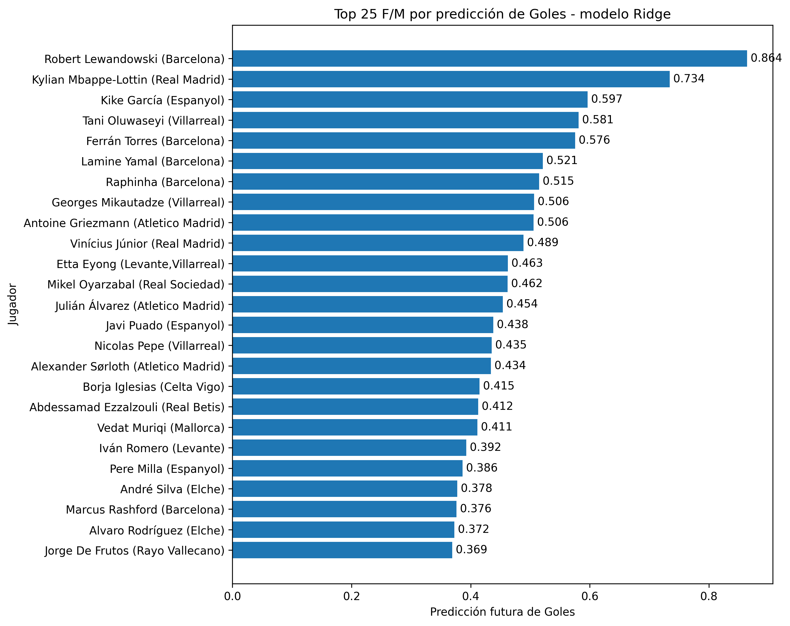
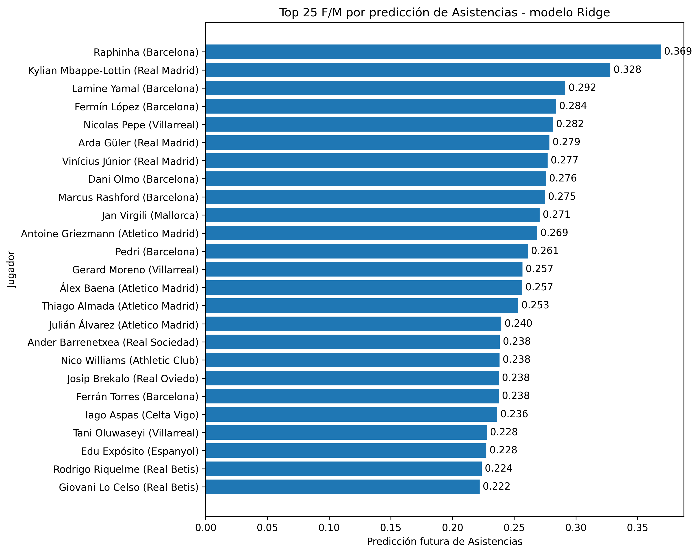
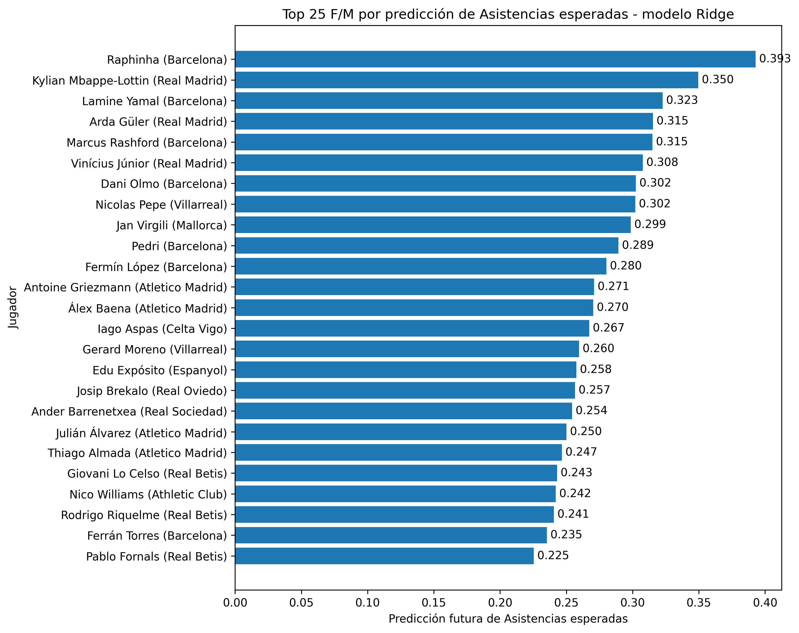

# Predicciones prospectivas multi-métrica con el modelo final Ridge

## Objetivo

Este informe recoge las predicciones prospectivas generadas sobre los jugadores actuales de LaLiga utilizando los modelos Ridge finales. Cada métrica ofensiva se predice mediante un modelo independiente.

Estas predicciones tienen carácter prospectivo: todavía no pueden compararse con un valor real futuro, por lo que deben interpretarse como una aplicación práctica del sistema y no como evaluación externa.

## Métricas predichas

- `xG_90`: goles esperados por 90 minutos
- `goals_90`: goles reales por 90 minutos
- `assists_90`: asistencias reales por 90 minutos
- `xA_90`: asistencias esperadas por 90 minutos

## Configuración

- Modelo base: `Ridge`
- Enfoque: un modelo independiente por métrica
- Jugadores no porteros evaluados: 309
- Jugadores F/M evaluados: 175

## Resumen por métrica

| metric_key   | metric_label          |   players_evaluated |   prediction_mean |   prediction_max |   prediction_min |
|:-------------|:----------------------|--------------------:|------------------:|-----------------:|-----------------:|
| xG_90        | Goles esperados       |                 309 |            0.1391 |           0.8354 |          -0.0511 |
| goals_90     | Goles                 |                 309 |            0.1265 |           0.864  |          -0.0178 |
| assists_90   | Asistencias           |                 309 |            0.0986 |           0.369  |          -0.0164 |
| xA_90        | Asistencias esperadas |                 309 |            0.107  |           0.3929 |          -0.015  |

## Top 25 F/M por goles esperados predichos

| model   |    id | player_name           | position   | position_main   | team_title         | league   | season    |   games |   time |   minutes_per_game |   goals_90 |   xG_90 |   assists_90 |   xA_90 |   shots_90 |   key_passes_90 |   xGChain_90 |   xGBuildup_90 |   predicted_next_xG_90 |   predicted_next_goals_90 |   predicted_next_assists_90 |   predicted_next_xA_90 |
|:--------|------:|:----------------------|:-----------|:----------------|:-------------------|:---------|:----------|--------:|-------:|-------------------:|-----------:|--------:|-------------:|--------:|-----------:|----------------:|-------------:|---------------:|-----------------------:|--------------------------:|----------------------------:|-----------------------:|
| Ridge   |   227 | Robert Lewandowski    | F S        | F               | Barcelona          | La-Liga  | 2025-2026 |      12 |    634 |            52.8333 |     1.1356 |  1.1886 |       0.142  |  0.1983 |     4.4006 |          0.8517 |       1.3035 |         0.3556 |                 0.8354 |                    0.864  |                      0.2015 |                 0.1675 |
| Ridge   |  3423 | Kylian Mbappe-Lottin  | F          | F               | Real Madrid        | La-Liga  | 2025-2026 |      15 |   1321 |            88.0667 |     1.0901 |  0.9227 |       0.2725 |  0.3683 |     4.8372 |          2.9296 |       1.1396 |         0.3538 |                 0.7713 |                    0.7343 |                      0.3279 |                 0.3496 |
| Ridge   |  6441 | Ferrán Torres         | F M S      | F               | Barcelona          | La-Liga  | 2025-2026 |      14 |    863 |            61.6429 |     0.8343 |  0.7285 |       0.1043 |  0.2078 |     3.3372 |          1.5643 |       1.1014 |         0.2239 |                 0.6596 |                    0.5756 |                      0.2376 |                 0.2354 |
| Ridge   | 13996 | Tani Oluwaseyi        | F S        | F               | Villarreal         | La-Liga  | 2025-2026 |      11 |    430 |            39.0909 |     0.4186 |  0.7246 |       0.2093 |  0.3692 |     2.7209 |          0.8372 |       1.1421 |         0.0483 |                 0.6295 |                    0.5813 |                      0.228  |                 0.1935 |
| Ridge   |  5074 | Kike García           | F S        | F               | Espanyol           | La-Liga  | 2025-2026 |      13 |    531 |            40.8462 |     0.5085 |  0.774  |       0      |  0.1872 |     3.7288 |          1.5254 |       0.9288 |         0.1326 |                 0.6242 |                    0.5965 |                      0.2082 |                 0.2065 |
| Ridge   |  8026 | Raphinha              | F M S      | F               | Barcelona          | La-Liga  | 2025-2026 |       9 |    547 |            60.7778 |     0.6581 |  0.5668 |       0.4936 |  0.4035 |     3.9488 |          2.9616 |       1.4924 |         0.6559 |                 0.5741 |                    0.5152 |                      0.369  |                 0.3929 |
| Ridge   | 11527 | Lamine Yamal          | F M S      | F               | Barcelona          | La-Liga  | 2025-2026 |      11 |    906 |            82.3636 |     0.4967 |  0.5157 |       0.6954 |  0.3813 |     5.0662 |          1.9868 |       1.1273 |         0.5309 |                 0.5583 |                    0.5213 |                      0.2915 |                 0.3227 |
| Ridge   |  2270 | Antoine Griezmann     | F S        | F               | Atletico Madrid    | La-Liga  | 2025-2026 |      15 |    570 |            38      |     0.6316 |  0.6268 |       0      |  0.2174 |     3.6316 |          2.0526 |       1.212  |         0.4696 |                 0.5458 |                    0.5055 |                      0.2686 |                 0.271  |
| Ridge   |  8187 | Georges Mikautadze    | F S        | F               | Villarreal         | La-Liga  | 2025-2026 |       9 |    473 |            52.5556 |     0.3805 |  0.6258 |       0.3805 |  0.2366 |     2.8541 |          0.9514 |       0.8175 |         0.0423 |                 0.5209 |                    0.5063 |                      0.1754 |                 0.1654 |
| Ridge   |  9002 | Vedat Muriqi          | F S        | F               | Mallorca           | La-Liga  | 2025-2026 |      13 |   1011 |            77.7692 |     0.7122 |  0.5075 |       0      |  0.0112 |     2.9377 |          0.3561 |       0.4912 |         0.1626 |                 0.5094 |                    0.4112 |                      0.0838 |                 0.0917 |
| Ridge   |  7008 | Vinícius Júnior       | F M S      | F               | Real Madrid        | La-Liga  | 2025-2026 |      15 |   1094 |            72.9333 |     0.4113 |  0.5053 |       0.3291 |  0.2807 |     3.702  |          2.3857 |       0.9259 |         0.2906 |                 0.5032 |                    0.4888 |                      0.2771 |                 0.3077 |
| Ridge   |  6531 | Alexander Sørloth     | F S        | F               | Atletico Madrid    | La-Liga  | 2025-2026 |      14 |    608 |            43.4286 |     0.5921 |  0.6095 |       0      |  0.0806 |     3.1086 |          0.8882 |       0.5781 |         0.0239 |                 0.4889 |                    0.4342 |                      0.1204 |                 0.1144 |
| Ridge   |  2234 | Mikel Oyarzabal       | F          | F               | Real Sociedad      | La-Liga  | 2025-2026 |      13 |   1150 |            88.4615 |     0.3913 |  0.5322 |       0.2348 |  0.2943 |     3.0522 |          1.8    |       0.7232 |         0.261  |                 0.4641 |                    0.4621 |                      0.2019 |                 0.2196 |
| Ridge   |  2543 | Borja Iglesias        | F S        | F               | Celta Vigo         | La-Liga  | 2025-2026 |      14 |    831 |            59.3571 |     0.5415 |  0.5096 |       0.2166 |  0.12   |     2.3827 |          1.4079 |       0.6842 |         0.1942 |                 0.4554 |                    0.415  |                      0.1644 |                 0.1748 |
| Ridge   | 10095 | Abdessamad Ezzalzouli | M S        | M               | Real Betis         | La-Liga  | 2025-2026 |      10 |    693 |            69.3    |     0.3896 |  0.52   |       0.2597 |  0.3173 |     2.987  |          1.2987 |       0.9768 |         0.2246 |                 0.4518 |                    0.4124 |                      0.2142 |                 0.2071 |
| Ridge   | 10930 | Etta Eyong            | F          | F               | Levante,Villarreal | La-Liga  | 2025-2026 |      14 |   1168 |            83.4286 |     0.4623 |  0.6027 |       0.2312 |  0.1782 |     2.3887 |          0.7705 |       0.5869 |         0.049  |                 0.4429 |                    0.4625 |                      0.115  |                 0.1061 |
| Ridge   | 10846 | Julián Álvarez        | F S        | F               | Atletico Madrid    | La-Liga  | 2025-2026 |      15 |   1147 |            76.4667 |     0.5493 |  0.5529 |       0.1569 |  0.3231 |     2.5109 |          2.2755 |       0.8627 |         0.3543 |                 0.4419 |                    0.4542 |                      0.2396 |                 0.2501 |
| Ridge   |  9275 | Iván Romero           | F M S      | F               | Levante            | La-Liga  | 2025-2026 |      11 |    855 |            77.7273 |     0.4211 |  0.4753 |       0      |  0.0934 |     2.5263 |          0.8421 |       0.5737 |         0.0637 |                 0.4339 |                    0.3925 |                      0.1229 |                 0.1248 |
| Ridge   |  4175 | Pere Milla            | F M S      | F               | Espanyol           | La-Liga  | 2025-2026 |      12 |    856 |            71.3333 |     0.5257 |  0.4845 |       0      |  0.2012 |     4.1005 |          1.6822 |       0.6059 |         0.1766 |                 0.431  |                    0.3862 |                      0.1853 |                 0.1974 |
| Ridge   |  2120 | Gerard Moreno         | F          | F               | Villarreal         | La-Liga  | 2025-2026 |       7 |    460 |            65.7143 |     0.7826 |  0.4155 |       0      |  0.3728 |     2.3478 |          2.1522 |       0.8378 |         0.4296 |                 0.4249 |                    0.3547 |                      0.2568 |                 0.2596 |
| Ridge   |  6170 | André Silva           | F S        | F               | Elche              | La-Liga  | 2025-2026 |      13 |    767 |            59      |     0.4694 |  0.4369 |       0      |  0.1343 |     2.5815 |          1.6428 |       0.6558 |         0.1207 |                 0.4206 |                    0.3776 |                      0.1903 |                 0.1988 |
| Ridge   | 11822 | Fermín López          | M S        | M               | Barcelona          | La-Liga  | 2025-2026 |       9 |    551 |            61.2222 |     0.6534 |  0.3489 |       0.3267 |  0.4167 |     3.5935 |          1.6334 |       1.1551 |         0.5553 |                 0.4195 |                    0.3197 |                      0.284  |                 0.2803 |
| Ridge   | 12160 | Alberto Moleiro       | F M S      | F               | Villarreal         | La-Liga  | 2025-2026 |      14 |    852 |            60.8571 |     0.6338 |  0.3517 |       0.2113 |  0.1824 |     2.3239 |          1.3732 |       0.6324 |         0.1816 |                 0.4062 |                    0.3183 |                      0.184  |                 0.1938 |
| Ridge   |  5656 | Nicolas Pepe          | F M S      | F               | Villarreal         | La-Liga  | 2025-2026 |      13 |    849 |            65.3077 |     0.212  |  0.5061 |       0.106  |  0.3026 |     2.9682 |          2.7562 |       1.1221 |         0.4565 |                 0.4045 |                    0.4352 |                      0.2815 |                 0.302  |
| Ridge   |  6954 | Juan Camilo Hernández | F          | F               | Real Betis         | La-Liga  | 2025-2026 |      14 |   1228 |            87.7143 |     0.3664 |  0.2963 |       0.1466 |  0.1619 |     3.0782 |          1.1726 |       0.615  |         0.18   |                 0.3998 |                    0.3273 |                      0.1754 |                 0.1923 |

## Figuras generadas

## Interpretación

El jugador con mayor predicción prospectiva de `xG_90` es `Robert Lewandowski`, con un valor estimado de 0.8354.

La predicción multi-métrica permite analizar distintas dimensiones del rendimiento ofensivo: finalización esperada, producción goleadora real, generación de asistencias y creación esperada de ocasiones para compañeros.

Estas salidas deben interpretarse como estimaciones estadísticas de apoyo al análisis, no como garantías deterministas de rendimiento futuro.